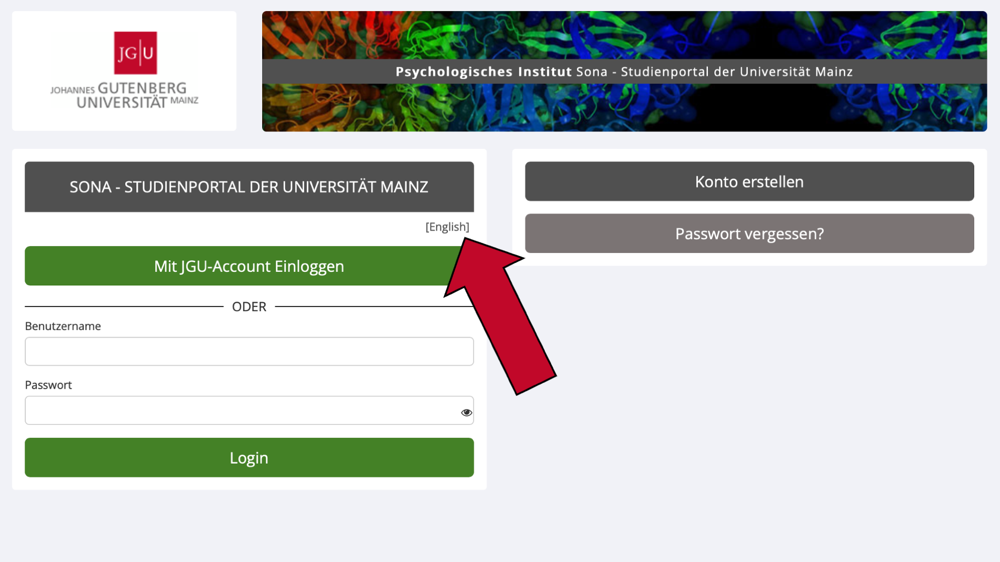
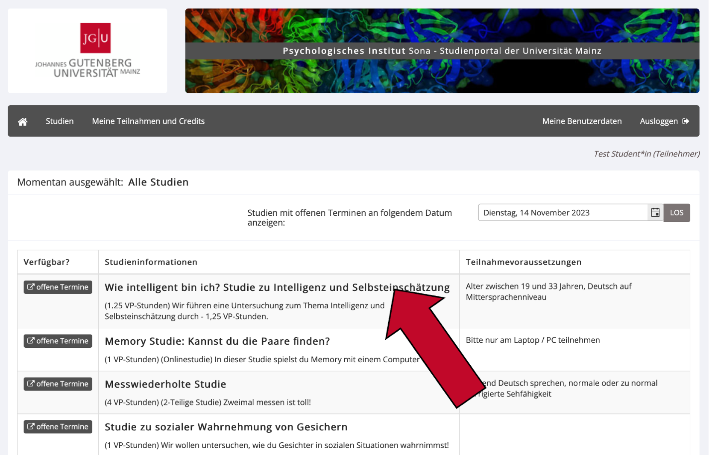
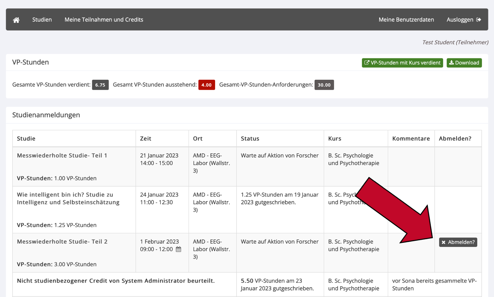
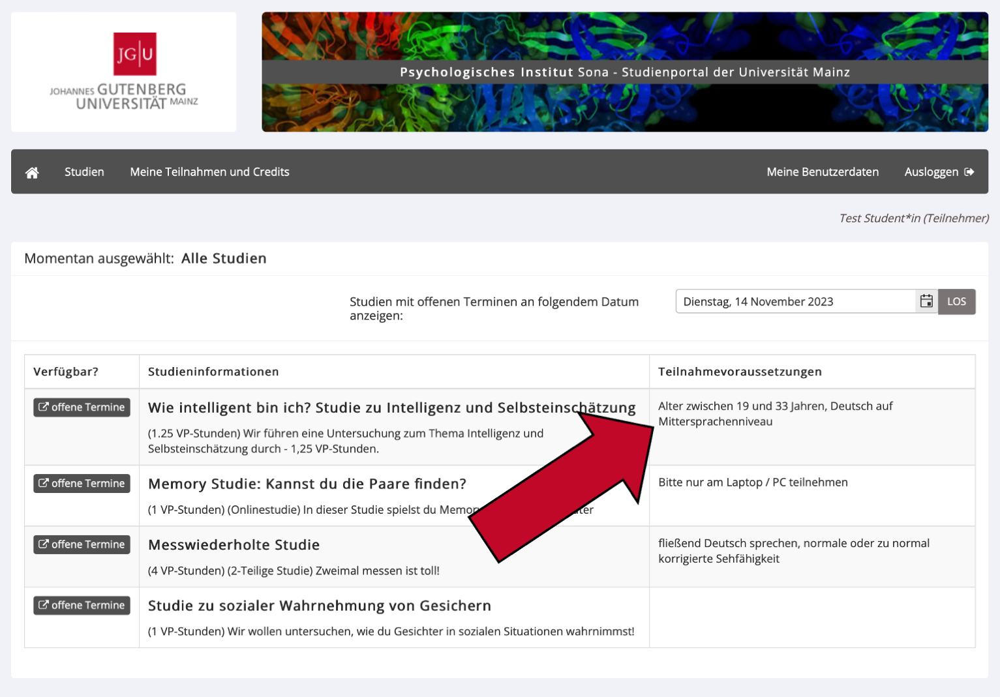
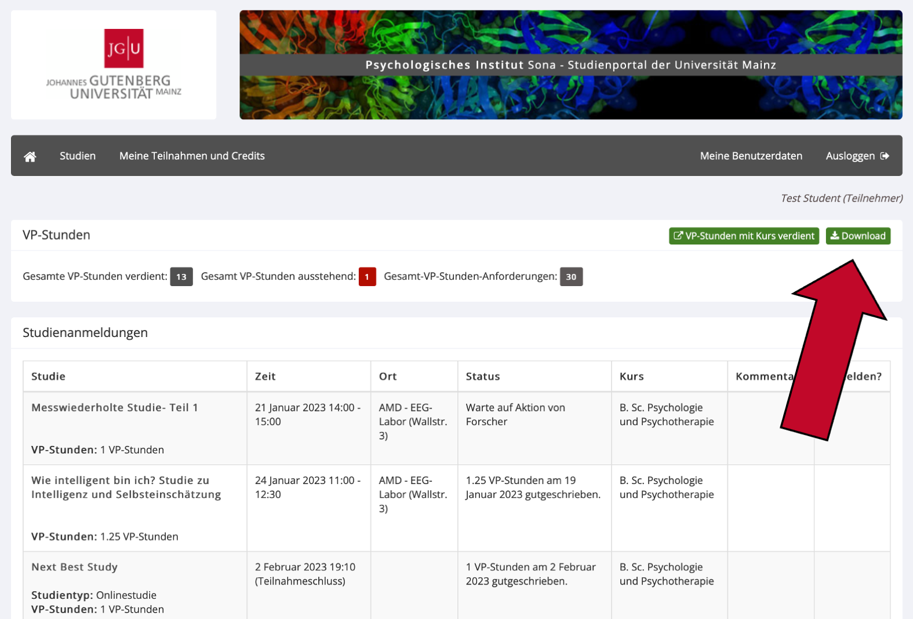
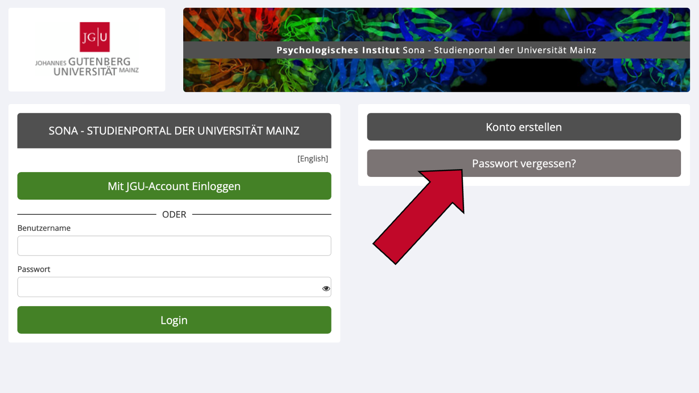
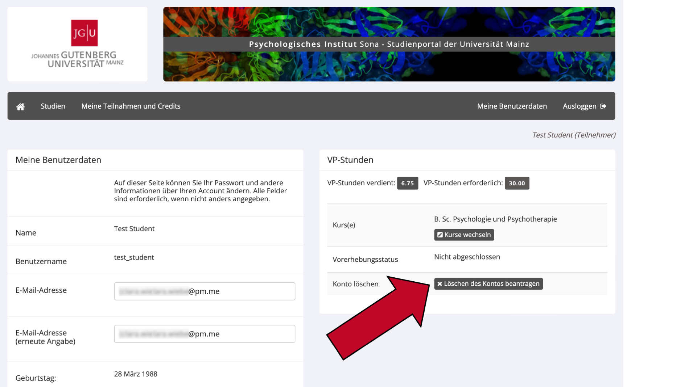

--- 
title: "Sona Versuchspersonen Handbuch"
author: "Clara Wiebel, José Carlos García Alanis"
date: "`r Sys.Date()`"
site: bookdown::bookdown_site
documentclass: book
bibliography: [packages.bib]
url: https://amd-lab.github.io/sona-researcher-jgu/index.html
#cover-image: path to the social sharing image like images/cover.jpg
description: "Dies ist das Versuchspersonen-Handbuch für Sona Systems des psychologischen Instituts der JGU Mainz"
link-citations: yes
github-repo:  AMD-Lab/sona-participants-jgu
lang: de
---

```{r include=FALSE}
options(width = 60)
options(warning.length = 100)
```


# Allgemeine Informationen

Dies ist das Sona-Handbuch für Versuchspersonen. Das Sona-Handbuch für Forscher\*innen finden Sie unter dieser Adresse:

- https://amd-lab.github.io/sona-researcher-jgu/

Die Sona-Website der Johannes Gutenberg-Universität Mainz finden Sie unter dieser Adresse:

- https://uni-mainz-jgu.sona-systems.com


## Was ist Sona und welche Vorteile bietet es?

Sona Systems ist ein Onlineportal, in dem Sie sich für psychologische Studien anmelden können, um Versuchspersonen-Stunden (VP-Stunden) oder Geld zu erhalten. Dies ist über den Webbrowser (empfohlen) oder die Sona App möglich; Sie benötigen lediglich einen Account bei Sona. 
Sona bietet Ihnen den Vorteil, dass Sie alle verfügbaren Studien auf einen Blick sehen und sich direkt für interessante Studien anmelden können. Sie werden von Sona automatisch an bevorstehende Studientermine erinnert. Darüber hinaus können Sie über Ihren Sona Account VP-Stunden sammeln. Durch eine Anzeige der bereits gesammelten VP-Stunden behalten Sie einen guten Überblick, wie viele VP-Stunden Sie bereits gesammelt haben und wie viele Sie noch benötigen. 


## Wer kann sich bei Sona anmelden?

Psychologiestudierende der Johannes-Gutenberg-Universität Mainz müssen als Teil ihrer Studienleistung Versuchspersonenstunden (VP-Stunden) sammeln. Dafür benötigen sie einen Account bei Sona. Allerdings sind auch Studierende andere Fächer sowie alle anderen Personen, die sich für psychologische Forschung interessieren, sehr willkommen. Viele Studien bieten auch eine monetäre oder sonstige Vergütung an, sodass sich die Studienteilnahme auch für Personen lohnt, die nicht Psychologie studieren. Die einzige Voraussetzung für einen Account bei Sona (und der Teilnahme an jeglichen psychologischen Studien) ist, dass Sie mindestens 18 Jahre alt sind.


## Kann ich auch selbst eine Studie einstellen?

Nein, mit einem Versuchspersonen-Account können Sie selbst keine Studien einstellen. Um Studien bei Sona einstellen zu können, benötigen Sie einen Forschenden-Account. Diese Accounts sind nur für Mitarbeiter\*innen (inklusive Hilfskräfte) des Psychologischen Instituts vorgesehen und werden nicht an Studierende vergeben, auch nicht für Abschlussarbeiten. Ob Sie Anspruch auf einen Forschenden-Account haben und wie Sie diesen erhalten lesen Sie im Sona Handbuch für Forschende: https://amd-lab.github.io/sona-researcher-jgu/index.html#wer-kann-einen-forschenden-account-erhalten. 


# Erste Schritte

## Wie erstelle ich einen Account als Student\*in der JGU? 

1.	Besuchen Sie Sona unter folgendem Link: https://uni-mainz-jgu.sona-systems.com. 
2.	Klicken Sie auf `Mit JGU-Account Einloggen`.

```{r echo = FALSE, out.width='92%', fig.align='center'}
knitr::include_graphics('images/Folie1a.png')
```

3. Sie werden nun auf eine Seite der Uni Mainz weitergeleitet. Geben Sie dort bitte Ihren JGU-Benutzernamen
(der Teil Ihrer JGU E-Mail-Adresse vor dem "@") und das dazugehörige Passwort ein. 
4. Akzeptieren Sie auf der nächsten Seite die Informationsweitergabe an Sona. Sie können ganz unten die Dauer festlegen, für die Ihre Entscheidung zur Informationsweitergabe gültig sein soll.
5. Auf der nächsten Seite müssen Sie einige Angaben zu Ihrem Account vervollständigen. Geben Sie unter `Student ID Number` bitte Ihre Matrikelnummer an, außerdem Ihr Geburtsdatum, Ihre Handynummer ([Wofür soll ich meine Handynummer angeben?]) und Ihren Studiengang an der Universität Mainz. 
6. Bestätigen Sie Ihre Eingaben, indem Sie auf `Request Account`klicken.
7. Nun können Sie sich jederzeit auf der Startseite von Sona mit Ihrem JGU Account anmelden, indem Sie auf `Mit JGU-Account Einloggen` klicken. 
7. Bei Ihrer ersten Anmeldung müssen Sie die Datenschutzrichtlinien von Sona akzeptieren. Zudem können Sie an einer kurzen  Prescreening Befragung teilnehmen, damit Ihnen passgenaue Studien angezeigt und solche Studien ausgeblendet werden, an denen Sie aus formalen Gründen (z.B. aufgrund Ihres Studienfachs) nicht teilnehmen können.


## Wie erstelle ich einen Account bei Sona, wenn ich nicht Student\*in der JGU bin?

1.	Besuchen Sie Sona unter folgendem Link: https://uni-mainz-jgu.sona-systems.com. 
2.	Klicken Sie nun in der rechten Spalte auf den Knopf `Konto erstellen`. 


```{r echo = FALSE, out.width='92%', fig.align='center'}
knitr::include_graphics('images/Folie1.png')
```


3.	Auf der folgenden Seite finden Sie links eine Anleitung und rechts eine Spalte, in der Sie Ihre Nutzerdaten eintragen können. Welchen Benutzernamen Sie wählen, ist egal, da Sie diesen lediglich für die Anmeldung auf der Website benötigen. Der Benutzername und die E-Mail-Adresse dürfen noch nicht im System vorhanden sein.
4.	Nach der Eingabe Ihrer Daten wird Ihnen ein vorläufiges Systempasswort per E-Mail zugesendet, das Sie nach Ihrer ersten Anmeldung in Sona ändern können. Diese E-Mail wird innerhalb weniger Minuten versandt. Bitte schauen Sie in ihrem Spam-Ordner nach, falls Sie die E-Mail nicht in Kürze erhalten.
5. Bei Ihrer ersten Anmeldung müssen Sie die Datenschutzrichtlinien von Sona akzeptieren. Zudem können Sie an einer kurzen  Prescreening Befragung teilnehmen, damit Ihnen passgenaue Studien angezeigt und solche Studien ausgeblendet werden, an denen Sie aus formalen Gründen (z.B. aufgrund Ihrer Eignung für bestimmte Laboruntersuchungen) nicht teilnehmen können.


## Wofür soll ich meine Handynummer angeben?

Zunächst einmal: Die Angabe der Handynummer bei Sona ist nicht verpflichtend. Wir würden es jedoch empfehlen, damit der\*die Forscher\*in Sie in Notfällen kontaktieren kann. Erstens kann dies der Fall sein, wenn Sie sich für eine Laborstudie angemeldet haben, sich aber verspäten oder den Raum nicht finden. Der\*Die Forscher\*in könnte Sie in diesem Fall anrufen, um sich mit Ihnen zu koordinieren. Zweitens könnte der\*die Forscher\*in Sie kontaktieren, falls Ihr Termin für eine Laborstudie sehr kurzfristig abgesagt werden muss. Ihre Handynummer wird ausschließlich für solche oder ähnliche Zwecke verwendet, wenn Sie sich für eine Laborstudie angemeldet haben. Ihre Handynummer wird nicht an Dritte weitergegeben oder dazu verwendet, Ihnen Werbung für neue Studien oder Erinnerungen zu schicken. 


## Wie ändere ich die Sprache auf der Website?

Sona Systems der Uni Mainz ist in Deutsch und in Englisch verfügbar. Die Auswahl der Sprache geschieht im Login-Fenster. 

1. Besuchen Sie die Website https://uni-mainz-jgu.sona-systems.com oder, falls Sie bereits angemeldet sind, loggen Sie sich aus (in der Menüleiste oben rechts auf `Ausloggen` klicken).
2. Bevor Sie Ihren Benutzernamen eingeben, können Sie die Sprache anhand des kleinen Knopfes über `Benutzername` in den eckigen Klammern ändern. 

```{r echo = FALSE, out.width='92%', fig.align='center'}

```


3.	Wenn Sie `[English]` sehen, wird Ihnen die Website gerade auf Deutsch angezeigt. Sie können auf `[English]` klicken, um die Website auf Englisch zu stellen. Wenn Sie `[Deutsch]` sehen, wird Ihnen die Website gerade auf Englisch angezeigt. Sie können auf `[Deutsch]` klicken, um die Website auf Deutsch zu stellen. 
4.	Nachdem Sie die Website auf Ihre präferierte Sprache umgestellt haben, können Sie sich wie gewohnt mit Ihren Benutzerdaten einloggen. 


## Wie ändere ich Daten in meinem Account?

Ihre E-Mail-Adresse, Ihre Telefonnummer, Ihr Passwort sowie Ihre E-Mail-Einstellungen können Sie selbst in Sona ändern:

1.	Loggen Sie sich mit Ihrem Account unter https://uni-mainz-jgu.sona-systems.com ein.
2.	Klicken Sie im oben im Menü auf `Meine Benutzerdaten`.

```{r echo = FALSE, out.width='92%', fig.align='center'}
knitr::include_graphics('images/Folie3.png')
```

3.	Ändern Sie Ihre Daten in den betreffenden Feldern.
4.	Bestätigen Sie Ihre Eingabe, indem Sie den grünen Knopf `Aktualisieren` ganz unten auf der Seite klicken.


Ihren (Benutzer-) Namen, Ihr Geburtsdatum sowie Ihre Student-ID (Matrikelnummer) können Sie nicht eigenständig ändern. Der genaue Wortlaut Ihres Benutzernamens ist nicht wichtig, da Sie diesen lediglich für den Login für die Website benötigen. Haben Sie allerdings einen Fehler bei der Eingabe Ihres Namens, Geburtsdatums oder Ihrer Student-ID (Matrikelnummer) gemacht, schreiben Sie bitte eine E-Mail an die Administration unter sona@uni-mainz.de, um die Daten ändern zu lassen. 


# Studienteilnahme


## Welche Arten von Studien gibt es? 

Es gibt zwei Grundlegende Arten von Studien: Laborstudien (auch Standard-Studien) und Online-Studien (auch Webstudien). 

* <b>Laborstudien</b> finden in den Räumen und Laboren des psychologischen Instituts statt. Diese befinden sich in der Binger Straße 14-16, 55112 Mainz oder in der Wallstraße 3. Der genaue Ort und Raum einer Studie steht in ihrer Detailansicht (dafür auf den Titel der Studie klicken). Laborstudien können auch aus mehreren Teilen bestehen (sogenannte Multi-Part Studien). In diesem Fall müssen Sie bei Ihrer Anmeldung zur Studie für jeden Studienteil einen Termin aussuchen. 

* <b>Online-Studien</b> werden an Ihrem PC, Laptop oder Smartphone bearbeitet und können somit jederzeit und an jedem Ort durchgeführt werden. Wir bitten Sie jedoch, alle Online-Studien in einer ruhigen Umgebung ohne Ablenkungen durchzuführen. Nur so kann die Qualität der gesammelten Daten gewährleistet werden.
Wenn Sie in der Detailansicht einer Online-Studie auf `Zeitfenster für diese Studie ansehen` klicken, wird Ihnen der Teilnahmeschluss der Studie angezeigt. Bis zu diesem Zeitpunkt sollten Sie die Studie bearbeiten. 
Manche Online-Studien haben Voraussetzungen an das Gerät, an dem Sie die Studie durchführen (z.B. nur am PC/Laptop). Diese Voraussetzungen sind der Detailansicht der Studie zu entnehmen. 


## Wie melde ich mich für Studien an?

1.	Loggen Sie sich unter https://uni-mainz-jgu.sona-systems.com mit Ihrem Sona-Account ein. 
2.	Im Hauptmenü klicken Sie auf den grünen Knopf `Verfügbare Studien anzeigen`. So gelangen Sie zu einer Übersicht der für Sie verfügbaren Studien. 

```{r echo = FALSE, out.width='92%', fig.align='center'}
knitr::include_graphics('images/Folie4.png')
```


3.	Klicken Sie den Namen einer Studie an, um in die Detailansicht zu gelangen. Dort erhalten Sie nähere Informationen zur Studie, z. B. zu Ihrer Art und Dauer, zu Teilnahmevoraussetzungen, besonderen Einschränkungen sowie einen Kontakt zu einer verantwortlichen Person. Bitte prüfen Sie, bevor Sie sich für eine Studie anmelden, ob Sie die Teilnahmebedingungen erfüllen. 

```{r echo = FALSE, out.width='92%', fig.align='center'}

```


4.	Haben Sie sich für eine Studie entschieden, klicken Sie in der Detailansicht der Studie ganz unten auf den grünen Knopf `Zeitfenster für diese Studie ansehen` (bei Laborstudien) oder auf `Anmelden`(bei Online-Studien). 
    a.	<b>Bei Laborstudien</b> können Sie nun ein Zeitfenster auswählen, zu dem Sie ins Labor kommen und an der Studie teilnehmen möchten. Klicken Sie bei einem für Sie passenden Zeitfenster auf den grünen Knopf `Anmelden?` Dann wird Ihnen nochmals eine kurze Übersicht mit dem Datum und dem Ort der Studie angezeigt. Klicken Sie erneut auf den grünen Knopf `Anmelden?` um Ihre Anmeldung abzuschließen. Nach erfolgreicher Anmeldung erhalten Sie eine Bestätigungs-E-Mail, die den Ort und die Zeit der Studie enthält. Zudem erhalten Sie einen Tag vor dem Termin eine Erinnerungs-E-Mail. 
    b.	<b>Bei Online-Studien</b> wird Ihnen, nachdem Sie auf `Anmelden` geklickt haben, der Teilnahmeschluss der Studie gezeigt. Bis zu diesem Termin sollten Sie die Studie online durchgeführt haben. Wenn Sie erneut auf den grünen Knopf `Anmelden?` klicken, sind sie zur Studie angemeldet. Sie erhalten dann eine Bestätigung per E-Mail. Um sofort mit der Online-Studie zu beginnen, klicken Sie auf den Knopf `Umfrage jetzt abschließen`.  Falls Sie die Studie nicht direkt im Anschluss bearbeiten wollen, können Sie sich bis zum Teilnahmeschluss jederzeit in Sona einloggen und die Studie unter `Verfügbare Studien anzeigen` finden. Wenn Sie auf den Titel der Studie klicken, können Sie auf den Knopf `Umfrage jetzt abschließen` klicken. Sie müssen sich dafür nicht erneut anmelden. 

Wenn Sie Ihre Anmeldung stornieren möchten, lesen Sie den nächsten Abschnitt dieser Dokumentation. 


## Was mache ich, wenn ich doch nicht zum Termin kommen kann?

Unentschuldigtes Fehlen bei Laborstudien ist ein großes Ärgernis für Forscher\*innen, da diese in vielen Fällen nur für Sie ins Labor kommen und das Experiment vorbereiten. Melden Sie sich daher bitte unbedingt ab, wenn Sie nicht zu einem Termin erscheinen können! 
Die Häufigkeit von unentschuldigtem Fehlen („No-Show“) wird für jede Versuchsperson im System dokumentiert. Bei zu vielen No-Shows behält sich die Administration vor, Ihren Zugang zu Studien auf Sona einzuschränken. 
Sie können sich nur dann von einer Studie abmelden, wenn die Abmeldefrist (meist 24 Stunden vor dem Termin) noch nicht abgelaufen ist. Falls die Abmeldefrist schon abgelaufen ist, lesen Sie den letzten Abschnitt dieses Beitrags.

1. Loggen Sie sich mit Ihrem Account bei Sona ein.
2. Wählen Sie den Menüpunkt `Meine Teilnahmen und Credits` aus. Hier gelangen Sie zu einer Übersicht über alle Studien, für die Sie angemeldet sind oder an denen Sie bereits teilgenommen haben. Neuere Studien befinden sich weiter unten in der Liste.

```{r echo = FALSE, out.width='92%', fig.align='center'}
knitr::include_graphics('images/Folie6.png')
```

3. Klicken Sie bei der betreffenden Studie rechts auf den Knopf `Abmelden?` und bestätigen Sie die Abmeldung mit `Ja, ich möchte meine Teilnahme absagen`. Sie erhalten daraufhin eine Bestätigungs-E-Mail. 

```{r echo = FALSE, out.width='92%', fig.align='center'}

```


Wenn Sie sich vom zweiten Teil einer zweiteiligen Standardstudie abmelden, wird die Anmeldung für den ersten Teil nicht automatisch aufgehoben. Da die Teilnahme an nur einem Teil der Studie nicht sinnvoll ist, sollten Sie entweder (a) die Versuchsleitung kontaktieren, um einen neuen Termin für den zweiten Teil zu finden, oder (b) sich auch vom ersten Teil der Studie abmelden. 

<b>Sollte die Abmeldefrist schon abgelaufen sein, kontaktieren Sie bitte den\*die Forscher\*in der Studie per E-Mail.</b> Wir bitten Sie, sich möglichst während der Abmeldefrist von der Studie abzumelden und diese Option nur in Notfällen zu nutzen, beispielsweise wenn Sie kurzfristig erkrankt sind oder Ihre Kinderbetreuung ausgefallen ist. Rechtzeitige Absagen erhöhen die Planbarkeit für Forscher\*innen. 


## Gibt es Voraussetzungen für die Studienteilnahme?

Grundsätzlich müssen Sie für die Teilnahme an psychologischen Studien in Sona mindestens 18 Jahre alt sein. Für manche Studien gibt es darüber hinaus weitere Voraussetzungen. Diese sind im Abschnitt `Teilnahmevoraussetzungen` jeder Studie aufgeführt, den Sie in der Überblicksansicht (wenn Sie im Hauptmenü `Verfügbare Studien anzeigen` anklicken) in der rechten Spalte finden. Wenn Sie auf die Detailansicht einer Studie gehen (dafür den Titel der Studie anklicken), sehen Sie die Teilnahmevoraussetzungen zudem im Abschnitt `Teilnahmevoraussetzungen`. 

```{r echo = FALSE, out.width='92%', fig.align='center'}

```


# Vergütung und Versuchspersonenstunden 

## Welche Art von Vergütung kann ich bekommen?

Für die Teilnahme an einer Studie in Sona können Sie <i>entweder</i> Versuchspersonen-Stunden (VP-Stunden) <i>oder</i> Geld erhalten. In einigen Fällen können Sie sich aussuchen, ob Sie die VP-Stunden oder Geld erhalten wollen. Eine doppelte Vergütung (im Sinne von VP-Stunden <i>und</i> Geld oder VP-Stunden <i>und</i> der Teilnahme an einer Lotterie o.Ä.) ist in der Regel nicht vorgesehen. 


## Wie viele VP-Stunden kann ich für die Teilnahme an einer Studie bekommen? 

Die Anzahl der Versuchspersonen-Stunden (VP-Stunden), die Sie für die Teilnahme an einer Studie erhalten, entspricht der Dauer der Studie. Bei Laborstudien zählt die ggf. nötige Vorbereitung und Nachbereitung des Experiments selbstverständlich zur Dauer dazu. Da die kleinste Einheit einer VP-Stunde ein halbe VP-Stunde (0,5) ist, wird im Zweifelsfall aufgerundet.

* Beispiel 1: Eine Online-Studie dauert 10 Minuten. Für die Teilnahme erhalten Sie 0,5 VP-Stunden. 
* Beispiel 2: Eine Laborstudie dauert 75 Minuten. Für die Teilnahme erhalten Sie 1,5 VP-Stunden. 


Wie lange eine Studie dauert und wie viele VP-Stunden Sie dafür erhalten, sehen Sie in der Studienübersicht und in der Detailansicht der Studie. Bei Laborstudien kann es vorkommen, dass die Studie länger dauert als geplant. In diesem Fall kann der\*die Forscher\*in die an Sie vergebenen VP-Stunden anpassen. Dies ist ebenso der Fall, wenn Sie eine Laborstudie vorzeitig abbrechen. Dann erhalten Sie so viele VP-Stunden, wie Sie Zeit im Experiment verbracht haben. Für Online-Studien erhalten Sie immer die angegebene Anzahl an VP-Stunden, da nicht geprüft wird, wie lange Sie tatsächlich für die Studie gebraucht haben. 


## Wann werden mir die VP-Stunden gutgeschrieben?

Nachdem Sie an einer Laborstudie teilgenommen haben, schreibt Ihnen der\*die Forscher\*in die VP-Stunden innerhalb der nächsten drei Werktage gut. Sollten Sie innerhalb einer Woche keine VP-Stunden für die Teilnahme an einer Laborstudie erhalten haben, kontaktieren Sie den\*die Forscher\*in bitte per E-Mail. 

Bei Online-Studien kann die Gutschrift von VP-Stunden entweder automatisch oder manuell durch den\*die Forscher\*in erfolgen. Bei einer automatischen Vergabe werden Sie von der letzten Seite der Online-Studie aus mit einem Link zu Sona zurückgeleitet, der Ihnen automatisch die angegebenen VP-Stunden vergibt. Sollten Sie während dieses Prozesses eine Fehlermeldung von Sona erhalten, machen Sie bitte einen Screenshot von Ihrem Display und wenden Sie sich umgehend per E-Mail an den\*die verantwortliche\*n Forscher\*in („researcher“) der Studie. 

Eine manuelle Vergabe von VP-Stunden für Online-Studien kann deutlich länger dauern, da diese oft erst nach Ende der Erhebung für alle Teilnehmer\*innen gleichzeitig gutgeschrieben werden. Somit erhalten Sie Ihre VP-Stunden nach der Teilnahme an einer solchen Online-Studie oft erst mehrere Wochen später. Sollten Sie die VP-Stunden dringend benötigen, kontaktieren Sie den\*die Forscher\*in bitte per E-Mail. 


## Wo sehe ich, wie viele VP-Stunden ich schon gesammelt habe?

Eine schnelle Übersicht über Ihre bereits gesammelten VP-Stunden finden Sie direkt im Hauptmenü rechts oben. 


```{r echo = FALSE, out.width='92%', fig.align='center'}
knitr::include_graphics('images/Folie8.png')
```

Um in die Detailansicht zu gelangen, klicken Sie im Menü auf `Meine Teilnahme und Credits`. 

```{r echo = FALSE, out.width='92%', fig.align='center'}
knitr::include_graphics('images/Folie6.png')
```

* Im oberen Teil der erscheinenden Seite sehen Sie eine Übersicht, wie viele VP-Stunden Sie bereits verdient haben, wie viele ausstehend sind und wie viele VP-Stunden Sie für Ihren Kurs insgesamt benötigen. „Ausstehend“ bedeutet, dass Sie bereits an Studien teilgenommen haben, für die Ihnen die dort angezeigte Anzahl an VP-Stunden noch nicht gutgeschrieben wurde.
* Im Abschnitt darunter befindet sich eine Auflistung aller Studien, für die Sie angemeldet sind oder an denen Sie bereits teilgenommen haben.


## Studienortswechsel: Wie übertrage ich Belege für VP-Stunden von anderen Universitäten auf mein Sona Konto?


Bitte beachten Sie: Sie können VP-Stunden, die Sie bereits an einer anderen Universität gesammelt haben (z.B. bei Studienortswechsel), <b>nur innerhalb Ihres ersten Semesters an der Johannes-Gutenberg-Universität Mainz</b> anerkennen lassen. 

1.	Falls Sie Papier-Belege haben, scannen Sie diese zunächst ein. 
2.	Fassen Sie alle E-Mail-Belege und digitalisierte Papier-Belege in <b>einem</b> PDF-Dokument zusammen. Für die Zusammenfassung von PDF-Dokumenten gibt es zahlreiche Online Tools. 
3.	Senden Sie dieses <b>eine</b> PDF-Dokument mit dem Betreff „VP-Stunden Anerkennung“ und unter der Angabe der folgenden Daten an sona@uni-mainz.de:
    * Name
    * Studiengang
    * Matrikelnummer 
    * Studentische E-Mail Adresse 

Die Administration wird Ihnen die VP-Stunden binnen eines Monats gutschreiben.  


## Übergangsphase: Was mache ich mit E-Mail/Papier-Belegen für VP-Stunden, die ich bereits an der Universität Mainz gesammelt habe?

Bereits gesammelte E-Mail- und Papier-Belege von Studien an der Universität Mainz werden aufrgund des hohen Verwaltungsaufwands nicht auf Ihr Sona Konto übertragen. Sammeln Sie beim Übergang zu Sona stattdessen all Ihre Belege in einem Dokument und heben Sie dieses gut auf. 

1.	Falls Sie Papier-Belege haben, scannen Sie diese zunächst ein. 
2.	Fassen Sie alle E-Mail-Belege und digitalisierte Papier-Belege in <b>einem</b> PDF-Dokument zusammen. Für die Zusammenfassung von PDF-Dokumenten gibt es zahlreiche Online Tools. 

Sobald Sie die restlichen VP-Stunden auf Sona gesammelt haben, reichen Sie sowohl das PDF-Dokument der alten Belege als auch die Belege von Sona beim Prüfungsamt ein (siehe [Wie reiche ich meine Sona VP-Stunden beim Prüfungsamt ein?]). 


## Wie reiche ich meine Sona VP-Stunden beim Prüfungsamt ein?

Sobald Sie alle benötigten VP-Stunden für Ihren Studiengang gesammelt haben, können Sie diese beim Prüfungsamt einreichen. Eine eigenständige Anmeldung in Jogustine ist nicht notwendig. Gehen Sie dabei wie folgt vor.

1.	Loggen Sie sich mit Ihrem Benutzernamen unter https://uni-mainz-jgu.sona-systems.com ein.
2.	Klicken Sie im Menüstreifen auf `Meine Teilnahmen und Credits`.
3.	Klicken Sie oben rechts auf den Knopf `Download`, um eine PDF-Übersicht Ihrer gesammelten VP-Stunden herunterzuladen.

```{r echo = FALSE, out.width='92%', fig.align='center'}

```

4.	Senden Sie diese PDF-Übersicht zusammen mit Ihrem <b>Namen, Studiengang und Ihrer Matrikelnummer</b> an Pruefungsamt-Psychologie@uni-mainz.de. Falls Sie vor der Einführung von Sona am Psychologischen Institut der Universität Mainz bereits E-Mail- oder Papier-Belege für VP-Stunden gesammelt haben, fügen Sie diese bitte in <b>einem</b> PDF-Dokument ebenfalls dieser E-Mail bei. 


<b>Achtung:</b> Wenn Sie im Bachelor an der Universität Mainz studieren, werden Ihre gesammelten VP-Stunden nach der Anerkennung durch das Psüfungsamt in Sona gelöscht! Der Grund hierfür ist, dass die VP-Stunden wieder auf Null gesetzt werden müssen, für den Fall, dass Sie im Master weiterhin an der Universität Mainz studieren.


# Sonstiges

## Wie verwalte ich meine E-Mail-Benachrichtigungen?

1.	Loggen Sie sich mit Ihrem Sona Account ein.
2.	Gehen Sie auf `Meine Benutzerdaten` und scrollen Sie nach ganz unten. In den letzten beiden Einstellungen können Sie auswählen, ob Sie Einladungs-E-Mails für Studien erhalten wollen und ob Sie eine wöchentliche E-Mail-Benachrichtigung mit verfügbaren Studien erhalten wollen. 
3.	Wählen Sie die gewünschte Einstellung aus und klicken Sie auf `Aktualisieren`, damit Ihre Eingabe im System gespeichert wird. 


## Kurs Wechseln von Bachelor zu Master

Wenn Sie sowohl den Bachelor als auch den Master Psychologie an der Universität Mainz studieren, können Sie Ihren Kurs selbstständig auf Sona ändern.

1. Loggen Sie sich mit Ihrem Account bei Sona ein.
2. Klicken Sie auf `Meine Benutzerdaten` oben rechts in der Menüleiste.
3. Klicken Sie nun in der rechten Spalte auf `Kurse wechseln` und wählen Sie den Kurs "Master Psychologie" aus.


```{r echo = FALSE, out.width='92%', fig.align='center'}

```


## Nutzernamen oder Passwort vergessen?

Wenn Sie Ihren Nutzernamen oder Ihr Passwort vergessen haben, setzen Sie bitte Ihr Passwort zurück. 

1. Besuchen Sie die Startseite von Sona: https://uni-mainz-jgu.sona-systems.com 
2. Klicken Sie rechts auf den Knopf `Passwort vergessen?`

```{r echo = FALSE, out.width='92%', fig.align='center'}

```

3. Geben Sie im erscheinenden Fenster Ihre E-Mail-Adresse oder Ihren Benutzernamen an. 
4. Daraufhin wird Ihnen ein Link zum Zurücksetzen Ihres Passworts per E-Mail zugesandt. Dieser Link ist 24 Stunden lang gültig. Sobald Sie auf den Link klicken, wird ein neues Passwort generiert und Ihnen gemeinsam mit Ihrem Nutzernamen per E-Mail zugeschickt. Wenn Sie eine Kennwortzurücksetzung angefordert haben und nach 30 Minuten noch keine E-Mail vom System eingetroffen ist, überprüfen Sie den Junk-Mail-Ordner Ihres E-Mail-Programms. 


## Sona APP

Es gibt eine kostenlose Sona App, die Sie im App Store (IOS) oder Google Play Store (Android) herunterladen können. Suchen Sie dafür nach „Sona“ oder „Sona Mobile“. Die App hat im Gegensatz zur Browser-Version allerdings nur eingeschränkte Funktionen. 


## Wie kann ich meinen Account löschen?

1.	Loggen Sie sich bei Sona ein und klicken Sie in der Menüleiste rechts auf `Meine Benutzerdaten`.
2.	In der rechten Spalte finden Sie den Knopf `Löschen des Kontos beantragen`. Klicken Sie auf diesen Knopf und bestätigen Sie die Löschung Ihres Accounts. 

```{r echo = FALSE, out.width='92%', fig.align='center'}

```

3.	Nach dieser Bestätigung wird ihr Konto sofort deaktiviert. Sie können sich nicht mehr bei Sona anmelden und erhalten keine E-Mails mehr von Sona. Die endgültige Löschung wird manuell von der Administration vorgenommen, um sicherzustellen, dass durch versehentliches Löschen keine VP-Stunden ungewollt verloren gehen. 

Wichtiger Hinweis: Bitte löschen Sie Ihren Account als Psychologiestudent\*in niemals selbstständig! Ihr Konto wird nach Ihrer Exmatrikulation durch das Prüfungsamt deaktiviert. Sollten Sie Ihren Account versehentlich gelöscht haben, wenden Sie sich schnellstmöglich an sona@uni-mainz.de, dann kann Ihr Account gegebenenfalls wiederhergestellt werden. 


## Noch Fragen?

Falls Sie weitere Fragen oder Probleme haben, wenden Sie sich bitte an die Administration unter sona@uni-mainz.de.


```{r include=FALSE}
# automatically create a bib database for R packages
knitr::write_bib(c(
  .packages(), 'bookdown', 'knitr', 'rmarkdown'
), 'packages.bib')
```
